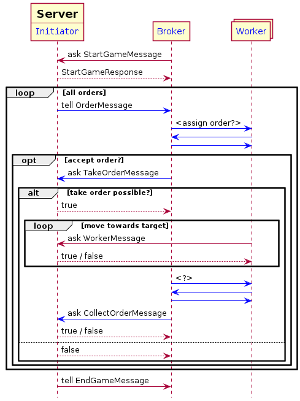

# AOT Gridworld Exercise with JIAC VI
In this module, we are using JIAC VI to set up a simple gridworld. The Server agent as well as all messages sent and received by it will be provided by us (TUB) and the students will have to implement the Broker and Worker agents and all interactions between them.

You need to have Maven and Java (jdk) installed to build the project and download dependencies. JIAC VI is implemented in Kotlin, but you can also use Java, however we strongly suggest Kotlin as the Kotlin-specific DSL is much easier to use. For an IDE with good Kotlin support we suggest using IntelliJ, others work well too.


## Overview of Provided Code

The code is using the JIAC VI agent framework developed by DAI-Labor.

* `pom.xml` is the Maven project description, defining the dependencies and where to find them
* `Main.kt` is used for configuring and starting the agents
* `ServerAgent.kt` defines the server side of the interaction; it will be explained in more detail below
* `Messages.kt` contains all the messages exchanged between the Server and the Client (i.e. Broker and Workers) according to the protocol; you can add additional messages for the communication between the Broker and Workers in a separate module, but the given messages must _not_ be changed or communication with the Server will not work
* `Models.kt` contains classes describing concepts in the Grid World; those are used by the Server to keep track of the current state of the game and its entities, but you can use the same classes in your Broker and Workers, as well; note that some model classes are also used as part of messages (e.g. `Order` and `Worker`) and like the messages themselves should _not_ be altered or communication with the official Server will not work
* `BrokerAgent.kt` and `WorkerAgent.kt` defines a simple stub that you can use as a starting point for your implementation

Most of the code is written in Kotlin, but it is fully compatible with Java, you can use Java libraries, classes and methods written in Java. If you are not familiar with Kotlin, you may also use Java for the decision logic and Kotlin only for the high-level reactive behavior of the agent.


## Interaction between Server and Client

The following sequence diagram shows the messages exchanged between (i) the Server and the Broker and Workers, and (ii) between the Broker and its Workers. The latter has to be implemented by you, thus there are no concrete messages shown. Since the Server also embodies the Initiator, the communication considered as brokering is highlighted in blue. 



The following messages are exchanged between the Server and the Broker and Workers.

* the game is initialized by the Broker with a `StartGameMessage`, including the grid file to play
* the Server replies with a `StartGameResponse` holding information about the game
* for each order that becomes active
    * the Server sends an `OrderMessage` to the Broker
    * (the Broker decides whether to accept that order)
    * if so, it sends a `TakeOrderMessage` to the Server
    * the server replies with a Boolean message (`true` or `false`, see details below)
    * (the Broker decides which Worker to assign the order to)
    * the selected Worker moves towards the order, in each turn...
        * sending a `WorkerMessage` with its action to the Server
        * who replies with a Boolean (`true` or `false`) whether the action succeeded
    * finally, when the Worker arrives at the site of the order, it sends another `WorkerMessage` to pick up the order
    * to which the Server replies with another Boolean, indicating whether the correct order was (still) there
    * the Broker sends a `CollectOrderMessage` to claim the reward of the completed order
    * which the Server replies with true if successful or false i.e. when already collected or not yet completed
* finally, the Server sends an `EndGameMessage` to the Broker informing them about the outcome of the game

An order has to be accepted a few turns after its creation to prevent orders from being accepted in the very last moment before their completion; the actual number of turns is a parameter of the server, which defaults to `3`.

Also note that:

* Workers are limited to 1 action per turn
* grid file names should be relative to the class path root
* remember that you can only play on grids that the server known (when using a remote server)
* active orders can overlap, i.e. more than one order can be active at a time
* a Worker may move around without being assigned an order
* maps can contain obstacles that are only revealed when a worker bumps into them, not being able to move there

**Note:** For now, obstacles don't have to be used, so don't worry about those. You can still use them if you want to.


## Scoring

At the end of the game, the score of your Broker will be calculated as the sum of the rewards for all accepted orders (successfully completed + collected and failed/past deadline)
```
    sum(reward(o) for o in accepted_orders)
```

where the reward is the orders value decreased by the turn-penalty for each turn between creation and completion (but not less than zero), or the negative of the orders value, if the completion failed, i.e.
```
    if turn > deadline: -value 
    else: max(value - (turnCompleted - turnCreated) * turnPenalty, 0)
```

See the `Server` and the `Order.getReward` method for details.


## The Server

The `ServerAgent` is the agent running on the server side. You can look at the code to get a better understanding what the server does, and maybe to deduce how certain things need to be done in JIAC, but you should _not_ alter the code. Remember that in the end your broker agent will run against a server agent hosted by us, using the original code, so any changes to the server may render your broker incompatible with our server!

The Server Agent embodies both, the role of the "initiator", and the "game master", checking that all the actions issued by the actual workers are legal, and applying them to its internal model of the game.

At the top of the Server Bean a number of configuration properties are defined. Those can be set when creating the server agent in the `Main` module.

The server is able to handle multiple games at once, which are stored in a map and retrieved using the `brokerId` of the broker who started them.

The bulk of the server's `behaviour()` can be subdivided in two main parts: Reacting to new messages, and updating the state of all active games and sending out messages accordingly. Here, the server will `respond` to different messages sent by the broker according to the interaction protocol. Further, in regular time intervals, each corresponding to one "turn" in the game, the Server checks if any new Order has become available or if any active order reached its deadline in the current turn and informs the brokers accordingly. Finally, when the game is over, the Server sends an according message to the brokers.


## The Client

The `BrokerAgent` and `WorkerAgent` can be used as a starting point for your implementation. In theory, you could implement both roles, i.e. the Broker and the Worker(s), in the same agent, but we strongly encourage you to create separate agents for the Broker and the Workers and creating one `BrokerAgent` and several `WorkerAgent`s with those beans. You can use the `Main` module for setting up your Agents.

Besides the beans, you may also need to create additional classes for further messages between the Broker and its Workers (only hinted in the sequence diagram), or further model elements for representing the state of the game from the Broker's perspective. (Of course, you can also use the classes used by the Server, but as mentioned before, you should not modify those or your Broker might not work any longer with a Server using the original classes.)


## Reactive Behaviour and Messaging in JIAC VI

The agent's main behaviour is defined by overwriting the `behaviour()` function, using a specific notation:

```kotlin
override fun behaviour() = act {
    every(Duration.ofSeconds(s)) {
        // called in regular intervals
    }
    on<MsgX> {
        // react to message send to agent with `ref tell MsgX(...)`
    }
    respond<MsgX, MsgY> {
        // respond to query sent by `ref invoke ask<MsgY>(MsgX(...)) { res -> ... }`
    }
}
```

Here, `ref` is a reference to another agent acquired with `val ref = system.resolve(name)`. Please refer to the server for more examples on how to use them. Of course, you do not have to put all the actual logic into those callback functions but can define more methods to be called. You can also look at the `jiac-vi-documentation.pdf`.


## Running the Game
To start the game locally simply run the `Main` module of this project. Remember to specify a gridfile in the `StartGameMessage` and to run enough `WorkerAgents` for your scenario.

### Gamelogs
By default, the game state will not be saved to a logfile. You can turn logging on in the `Main` module and specify a single logfile if you don't wish to save each new game on its own (this might be useful to monitor the gridworld).

